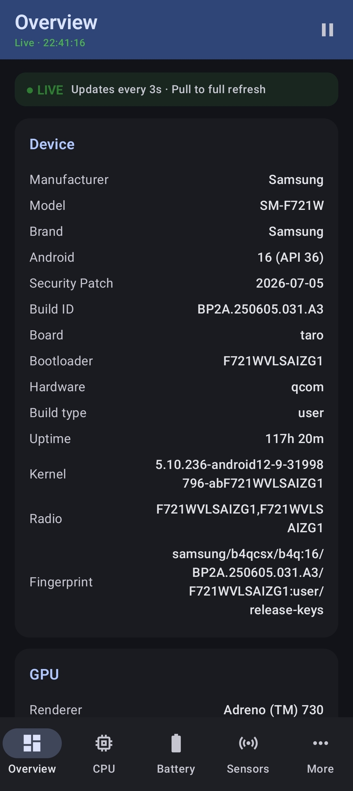
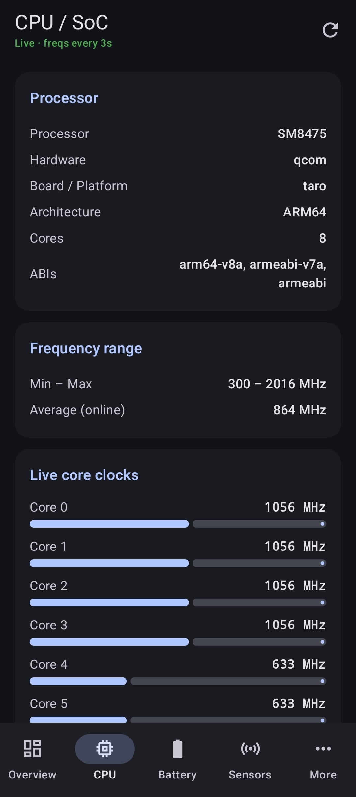
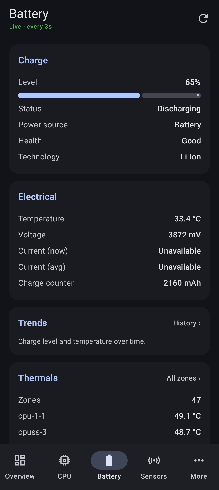
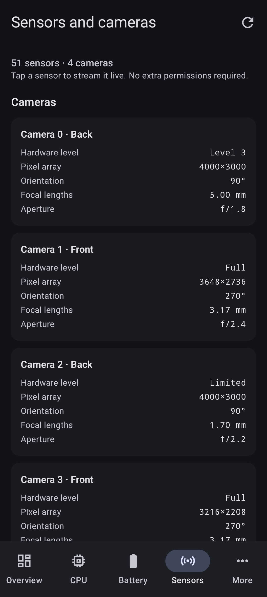
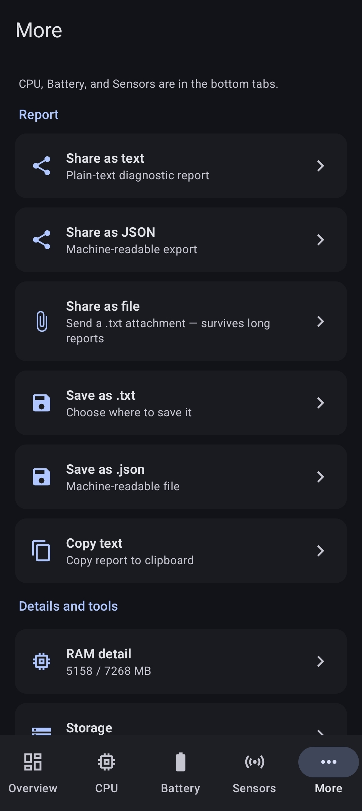

# Phone Diagnostic Tool

Privacy-focused Android diagnostics: CPU, GPU, battery, RAM, storage, display, sensors, cameras, and optional network latency — all on-device.

**No accounts. No analytics SDKs. No cloud upload of reports.**

[](https://github.com/ScoobyDouche/PhoneDiagnosticTool/releases/latest)
[](https://github.com/ScoobyDouche/PhoneDiagnosticTool/actions/workflows/build-apk.yml)

## Screenshots

| Overview | CPU / SoC | Battery | Sensors | More |
|:--:|:--:|:--:|:--:|:--:|
|  |  |  |  |  |

Captured on a Galaxy Z Flip4 running Android 16.

## Features

- Device overview (model, Android version, security patch, fingerprint, board, bootloader, uptime)
- CPU / SoC with best-effort current core frequencies and min/max range
- GPU (OpenGL ES)
- Live battery, RAM, and network status
- Sensors list + brief live samples (accelerometer, gyro, light, proximity, etc.)
- Tap any sensor to stream it live with per-axis charts
- Camera characteristics (facing, pixel array, focal lengths, hardware level)
- Optional TCP latency check to `8.8.8.8:53` (can be disabled in Settings)
- Network detail: IP addresses, DNS & private DNS, Wi‑Fi link speed / band / signal, carrier, plus a 5-probe latency burst with min / avg / max / jitter / loss
- Storage volumes + per-app breakdown (with Usage Access)
- Process RAM detail
- History: battery, temperature and RAM trends charted from up to 24 h of samples
- Background monitor with rotating log (capped at **5000** lines)
- CPU load test (1 / 5 / 10 min) with a k-ops/s score
- Share as text or JSON, share as a file attachment, save to a file, or copy to clipboard
- Theme: system / light / dark
- Settings + About (license & privacy summary)
- UI chrome fully externalised to string resources (ready for translation packs)

## Privacy

See **[PRIVACY.md](PRIVACY.md)**.

Short version: diagnostics run locally. The only network use is an optional latency probe you can turn off.

## Download

**GitHub Releases** (recommended today) — grab the `.apk` from the
[latest release](https://github.com/ScoobyDouche/PhoneDiagnosticTool/releases/latest).
Allow install from unknown sources when prompted.

Debug CI builds use a fixed keystore so they install over each other. **Store / production** builds use a separate release key when configured (see [docs/DISTRIBUTION.md](docs/DISTRIBUTION.md)).

**CI artifacts** — Actions → **Build APK** → latest green run:

| Artifact | Contents |
|----------|----------|
| `PhoneDiagnostic-debug` | Debug-signed APK |
| `PhoneDiagnostic-release-apk` | Release APK (signed if secrets set) |
| `PhoneDiagnostic-release-aab` | Play-ready AAB (signed if secrets set) |

Artifacts expire after 14 days; Releases do not.

## Stores

Work in progress — packaging is ready; store accounts and listings are manual.

- **Google Play** — upload the release **AAB**; enroll in Play App Signing
- **F-Droid** — draft metadata in [`metadata/com.phonediagnostic.yml`](metadata/com.phonediagnostic.yml)

Full checklist: **[docs/DISTRIBUTION.md](docs/DISTRIBUTION.md)**.

## Changelog

See **[CHANGELOG.md](CHANGELOG.md)** for release history.

## Build from source

**Requirements:** JDK 17, Android SDK 35

```bash
git clone https://github.com/ScoobyDouche/PhoneDiagnosticTool.git
cd PhoneDiagnosticTool
# Optional: decode CI debug keystore for local parity
# base64 -d keystore/debug.keystore.b64 > keystore/debug.keystore
gradle test              # unit tests
gradle assembleDebug     # or open in Android Studio
gradle assembleRelease   # R8 + shrink; signs if RELEASE_* env is set
gradle bundleRelease     # Android App Bundle for Play
```

CI runs tests, debug APK, release APK, and release AAB on every push and pull request.

## Permissions

| Permission | Why |
|------------|-----|
| `INTERNET` | Optional latency measurement only |
| `ACCESS_NETWORK_STATE` | Detect Wi‑Fi / cellular / etc.; DNS and link details on the Network screen |
| `ACCESS_WIFI_STATE` | Wi‑Fi link speed, band and signal strength |
| `VIBRATE` | Vibration hardware check under Tools |
| `PACKAGE_USAGE_STATS` | Per-app storage (user must grant Usage Access) |
| `REQUEST_DELETE_PACKAGES` | Uninstall from storage detail |
| `FOREGROUND_SERVICE` / `SPECIAL_USE` | Optional background monitor |
| `POST_NOTIFICATIONS` | Background monitor notification (Android 13+) |

Camera and sensors use system APIs without requesting CAMERA permission (characteristics only; no capture).

## Tech

- Kotlin, Jetpack Compose, Material 3
- ViewModel + StateFlow
- Min SDK 26 · Target / compile SDK 35
- Version **1.1.0**

Diagnostics are stored only on the device: a rotating log and a 24 h metric
history live in internal storage, and the app opts out of Android cloud backup
and device transfer entirely (`allowBackup="false"`).

## License

[MIT](LICENSE)
